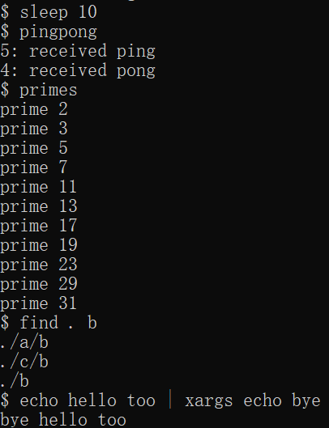
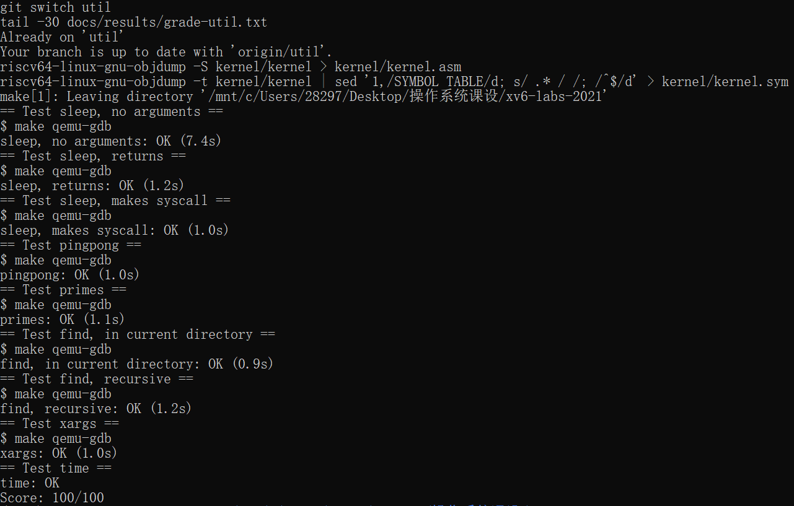

# 操作系统课程设计报告：MIT xv6 Labs 2021

> 本项目采用“一份总报告、每个实验一个章节”的组织方式。完整源代码、评分文本和关键截图统一保存在同一个 GitHub 仓库中。

## 1. 项目概述

本课程设计选择 MIT xv6 Labs 2021（RISC-V）项目，通过阅读 xv6 源码、修改用户程序和内核，理解 Unix-like 操作系统中的系统调用、页表、中断、写时复制、线程、网络、锁、文件系统和内存映射等机制。

2021 年实验顺序为：`util`、`syscall`、`pgtbl`、`traps`、`cow`、`thread`、`net`、`lock`、`fs`、`mmap`。每个实验使用独立 Git 分支，仓库整体只有一个 GitHub 地址：<https://github.com/Jdeciderz23/xv6-labs-2021>。

## 2. 实验环境

- 宿主环境：Windows + WSL2
- Linux：Ubuntu 24.04.3 LTS
- 编译工具：`make`、`riscv64-linux-gnu-gcc`、`binutils-riscv64-linux-gnu`
- 运行与调试：`qemu-system-riscv64`、`gdb-multiarch`

在 Ubuntu 中执行 `make qemu` 能启动 xv6 并进入 `$` shell，说明编译、文件系统镜像生成和 QEMU 运行链路正常。

## 3. 仓库结构与报告策略

仓库采用“一个总仓库 + 多个实验分支”的方式管理。`user/` 目录保持 xv6 规定的直接布局，实验程序直接放在 `user/` 下，并在 `Makefile` 的 `UPROGS` 中加入。不同实验通过 Git 分支区分，不在 `user/` 下建立 `util/`、`syscall/` 等子目录。

报告和证据文件按以下方式留存：

```text
docs/
├── report.md                 # GitHub 在线阅读版
├── xv6-labs-2021-report.docx # 可编辑 Word 版
├── work-log.md               # 工作日志
└── results/
    ├── grade-<lab>.txt       # make grade 完整输出
    └── screenshots/<lab>/    # 评分和关键功能截图
```

每个实验完成后固定执行：切换分支、运行 `make grade`、运行一个关键功能、保存评分和截图、更新报告与日志、提交并推送 Git。

## 4. Lab util：Unix 用户程序

### 4.1 实验目的与内容

本实验要求完成五个用户程序：

| 程序 | 主要训练内容 |
|---|---|
| `sleep` | 命令行参数解析和系统调用 |
| `pingpong` | `fork`、双向 `pipe` 和 `wait` |
| `primes` | 进程管道构成的递归素数筛 |
| `find` | 目录项读取和递归遍历 |
| `xargs` | 标准输入分行解析与 `exec` |

### 4.2 实现原理

`sleep` 检查参数后调用 xv6 已有的 `sleep` 系统调用。`pingpong` 使用两条管道分别完成父到子、子到父的单字节通信，双方关闭不用的文件描述符后由父进程 `wait` 回收子进程。

`primes` 让每一级筛选器运行在独立进程中：读取当前管道的第一个数作为素数，再把不能被该素数整除的数字传给下一级。`find` 使用 `open`、`fstat` 和 `read` 读取 `struct dirent`，跳过 `.` 和 `..` 后递归查找。`xargs` 逐字符读取标准输入，以换行分隔命令行，组合参数后由子进程调用 `exec`。

### 4.3 关键实现片段

报告只保留能说明核心逻辑的短代码，完整代码直接通过 GitHub 查看。例如素数筛的核心循环：

```c
while(read(input, &n, sizeof(n)) == sizeof(n))
  if(n % prime != 0)
    write(next, &n, sizeof(n));
```

目录遍历的关键是读取目录项并排除特殊项：

```c
if(de.inum == 0 || strcmp(name, ".") == 0 ||
   strcmp(name, "..") == 0)
  continue;
find(buf, target);
```

### 4.4 测试与结果

在 Ubuntu 中执行：

```bash
make grade 2>&1 | tee docs/results/grade-util.txt
```

评分结果：

```text
sleep, no arguments: OK
sleep, returns: OK
sleep, makes syscall: OK
pingpong: OK
primes: OK
find, in current directory: OK
find, recursive: OK
xargs: OK
time: OK
Score: 100/100
```

关键运行截图：



评分截图：



### 4.5 问题与解决

1. Windows Git 和 WSL Git 的换行符策略不同，导致 Git 状态异常；通过关闭本仓库 CRLF 自动转换并统一使用 LF 解决。
2. Ubuntu 24.04 的 GCC 对 xv6 既有递归警告更严格，在 `Makefile` 的 `CFLAGS` 中加入 `-Wno-error=infinite-recursion`。
3. 初次评分缺少课程脚本要求的 `time.txt`，功能测试虽全部通过但得分为 `99/100`；补充后达到 `100/100`。
4. 评分前停止残留 QEMU 进程，避免影响 `make clean` 和 `fs.img` 重新生成。

### 4.6 实验小结

本实验建立了后续实验所需的用户态编程基础。五个程序分别覆盖了系统调用、进程与管道、递归并发、文件系统目录项和 `exec` 参数组织。实现过程中体会到 xv6 用户库非常精简，需要更关注底层系统调用、文件描述符关闭和缓冲区边界。

## 5. 后续实验章节模板

后续 `syscall`、`pgtbl`、`traps`、`cow`、`thread`、`net`、`lock`、`fs`、`mmap` 继续追加到本总报告中。每章保留以下小节即可：

1. 实验目的与要求
2. 实现原理
3. 关键代码（只放核心片段）
4. 测试命令、评分和 1-2 张代表性截图
5. 问题与解决
6. 实验小结

建议每个实验正文控制在 2-4 页，完整代码和完整评分输出放在 GitHub 仓库，不在报告中重复粘贴。

## 6. 答辩前检查

对每个实验分支执行 `make grade` 并保存结果；再用 `make qemu` 运行一个关键命令。答辩时展示对应分支、关键代码、评分文本或截图，并现场运行一个短命令即可，不需要让十个 QEMU 同时运行。

